# Bayesian neural networks

This is a repository that demonstrates the most popular variants and flavors of Bayesian neural networks and applies them to a number of tasks (binary classification, regression and MNIST classification) through number of neural network architectures (Feed-forward/convoltuional) and compares their performance to identical plain pointwise methods. 

- [Bayesian neural networks](#bayesian-neural-networks)
  - [Description](#description)
  - [Structure](#structure)
  - [Experiments](#experiments)
    - [Results](#results)
  - [Requirements](#requirements)
  - [Contributing](#contributing)


## Description

Deep learning tools have gained tremendous attention in applied machine learning. However such tools for regression and classification do not capture model uncertainty. In comparison, Bayesian models offer a mathematically grounded framework to reason about model uncertainty, but usually come with a prohibitive computational cost [\[Gal et al., 2015\]](https://arxiv.org/abs/1506.02142).

In this repository, I demonstrate capabilities of multiple methods that introduce Bayesanity and uncertainty quantification to standard neural networks on multiple tasks. The tasks include binary classification, regression and classification of MNIST digits under rotation. Each method/architecture is benchmarked against its pointwise counterpart that has been hand-tuned for best performance.

**Bayesian methods**: The implemented Bayesian methods are [Bayes-by-backprop](https://arxiv.org/abs/1505.05424) (with an added lower-variance [local reparametrization trick](https://arxiv.org/abs/1506.02557)), [Monte Carlo Dropout](https://arxiv.org/abs/1506.02142) and [Stochastic gradient Langevin Dynamics](https://www.ics.uci.edu/~welling/publications/papers/stoclangevin_v6.pdf) (with [pre-conditioning](https://arxiv.org/abs/1512.07666)).

Each method has its own separate model definition or an optimiser for clarity and they are benchmarked undeer the same settings. The settings were hand-tuned, so if you find better ones definitely let me know.

## Structure

```
   .
   |-experiments            # Where all the experiments are located
   |---data                 # Where all the data is stored
   |---scripts              # Pre-configured scripts for running the experiments
   |-src                    # Main source folder, also containing the model descriptions
   |---models
   |-----pointwise
   |-----stochastic
   |-------bbb              # Implementation of Bayes-by-backprop with local reparametrisation trick
   |-------mc_dropout       # Monte carlo dropout
   |-------sgld             # Stochastic gradient langevin Dynamics with and without pre-conditioning
   |-figs                   # Sample figures, corresponding to the collected results for the respective methods (collected and transferred manually)
```

## Experiments

There are in total three different experiments, regression, binary classification and MNIST digit classification. The default runners for the experiments are under the `experiments` folder, where the scripts for easy pre-configured runs can be found under `experiments/scripts/`.

To run the experiments, simply prepare youself a a virtual environment and navigate to the `experiments/scripts` folder and pick one of the methods/tasks and run it as:

```
python3 bbb_binary_classification.py
```

No additional tuning should be necessary. However, the scripts assume that you have a GPU available for training and inference. In case you just wanto to use CPU, do:

```
python3 bbb_binary_classification.py --gpu -1
```

### Results 

These are the results that you can expect with pre-configured scripts for binary classification:

| Pointwise            |  MC Dropout | BBB | SGLD |
:-------------------------:|:-------------------------:|:-------------------------:|:-------------------------:
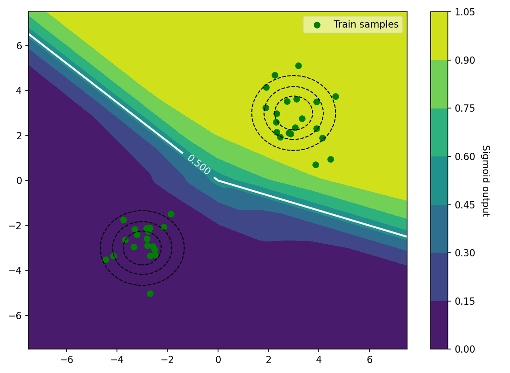 | 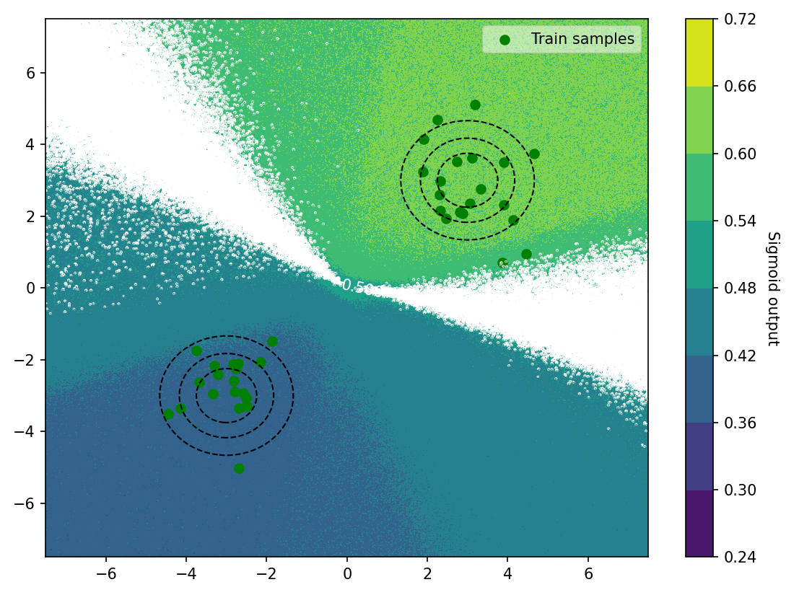 | 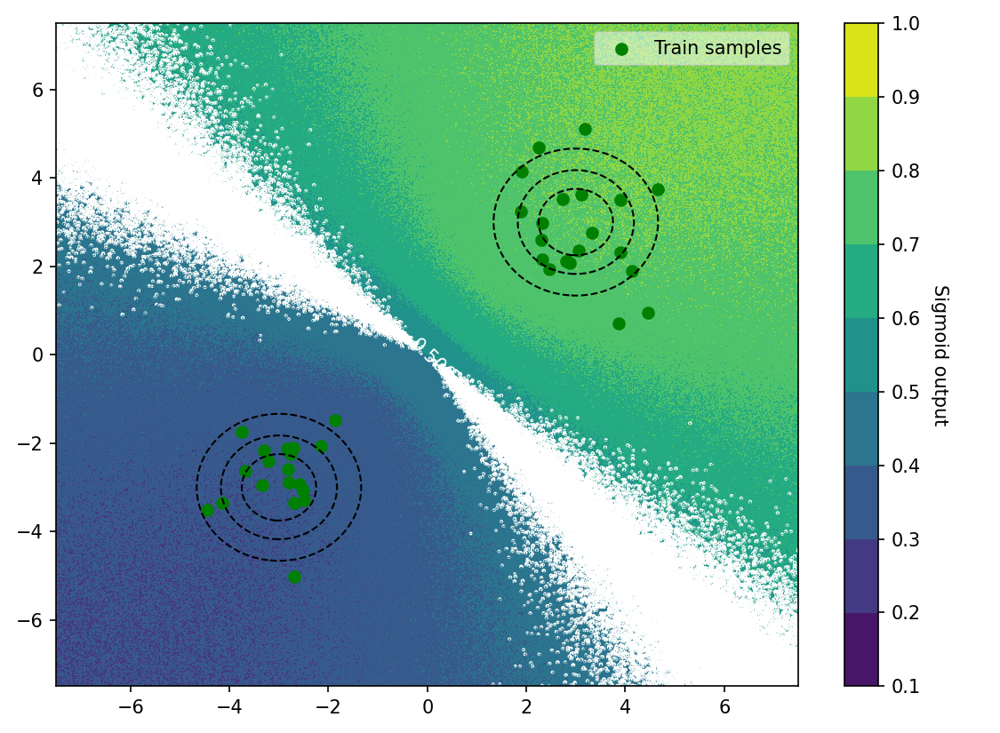 | 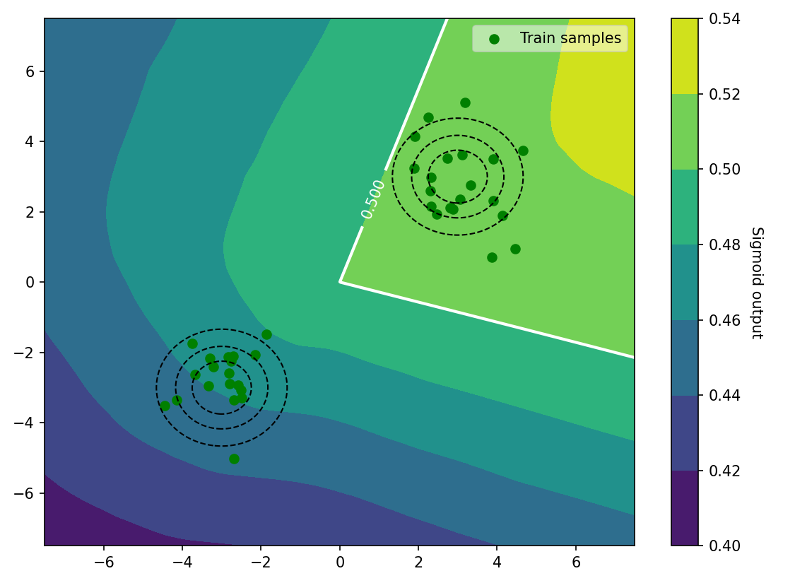
 
These are the results that you can expect with pre-configured scripts for regression:

| Pointwise            |  MC Dropout | BBB | SGLD |
:-------------------------:|:-------------------------:|:-------------------------:|:-------------------------:
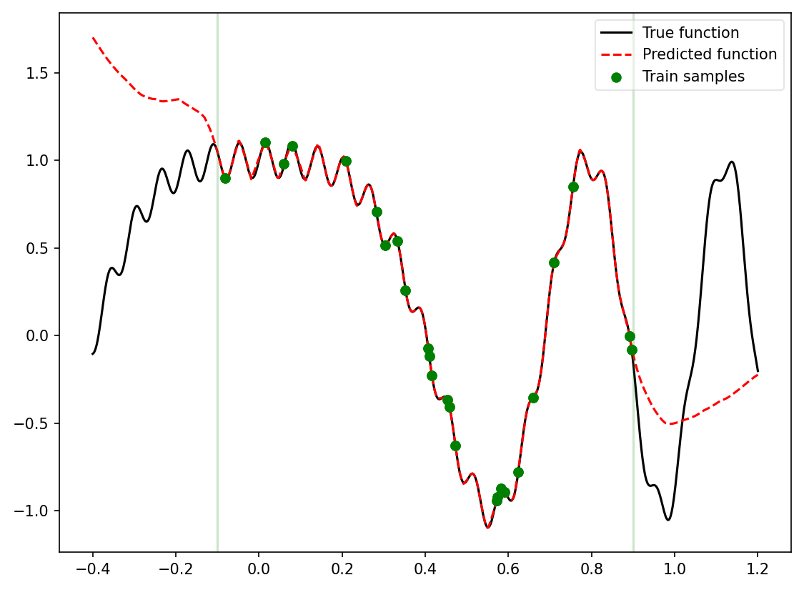 | 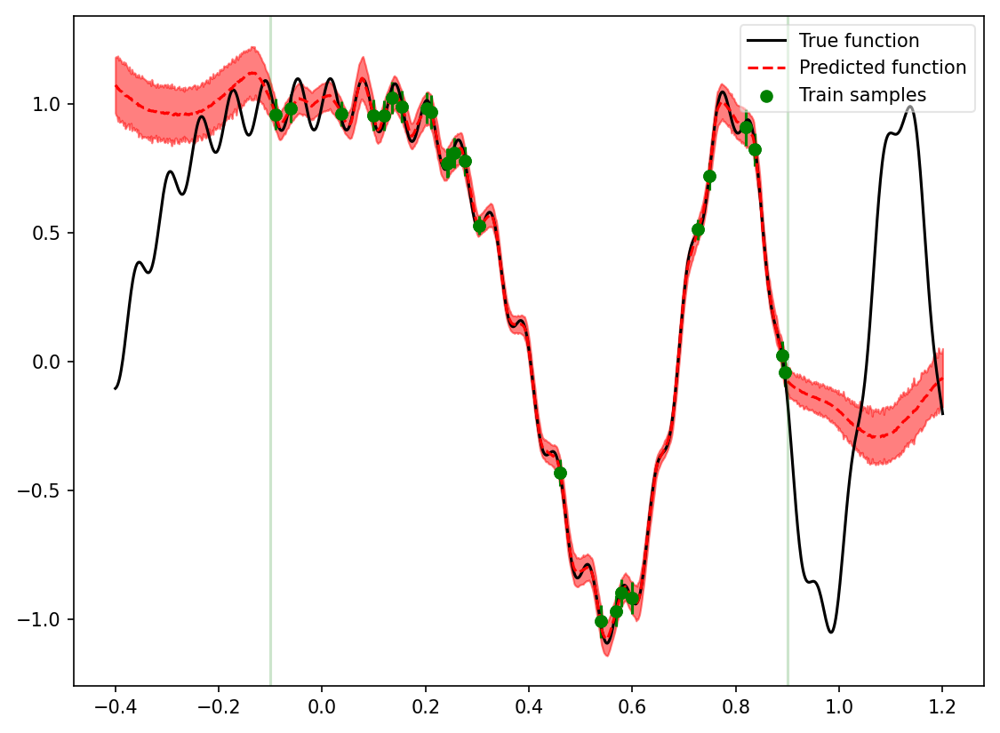 | 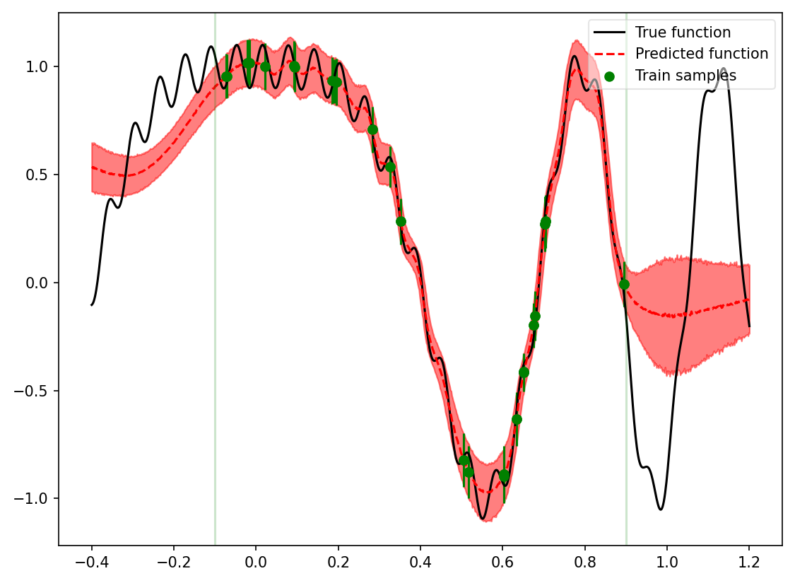 | 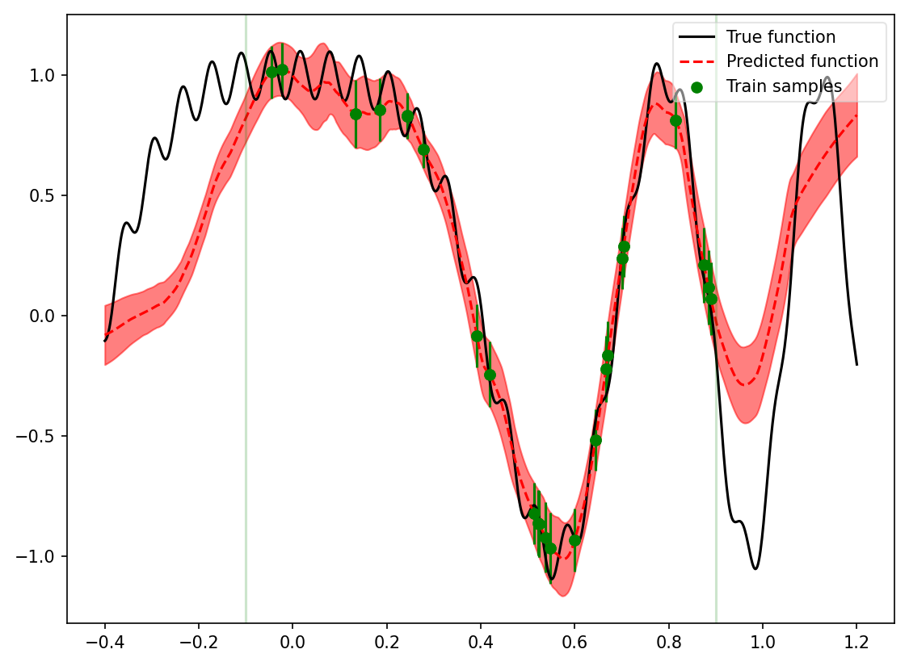

These are the results that you can expect with pre-configured scripts for MNIST classification when we have a rotated digit:
| Rotated digit one           | 
:-------------------------:
 

| Pointwise            |  MC Dropout | BBB | SGLD |
:-------------------------:|:-------------------------:|:-------------------------:|:-------------------------:
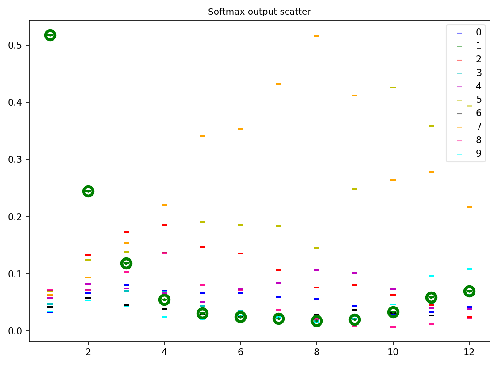 | 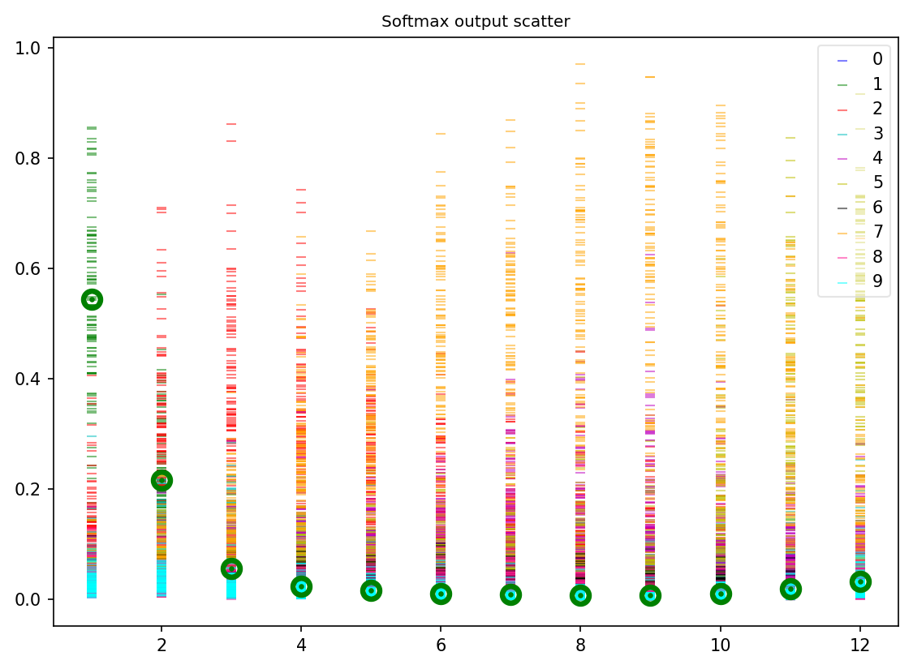 | 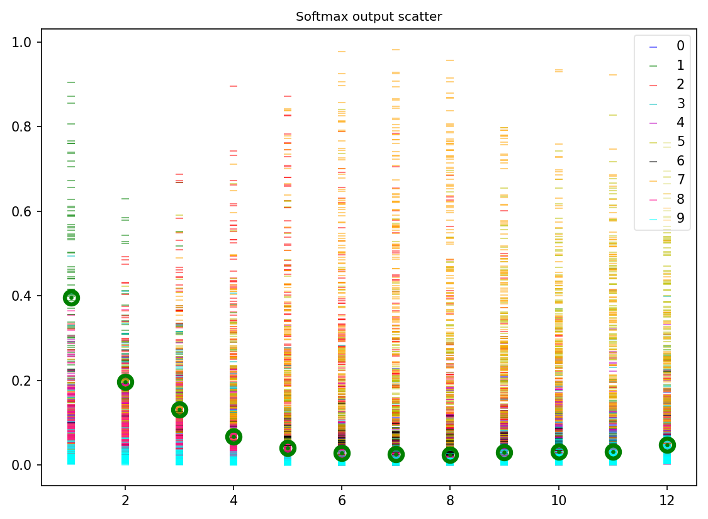 | 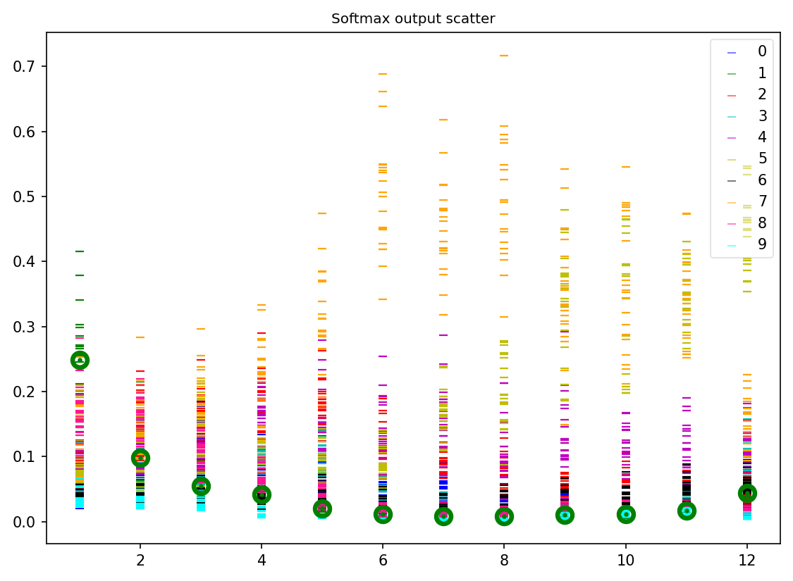

and these are the results of confidence on out-of-distributions samples of a random Gaussian noise with zero mean and unit variance

| Pointwise            |  MC Dropout | BBB | SGLD |
:-------------------------:|:-------------------------:|:-------------------------:|:-------------------------:
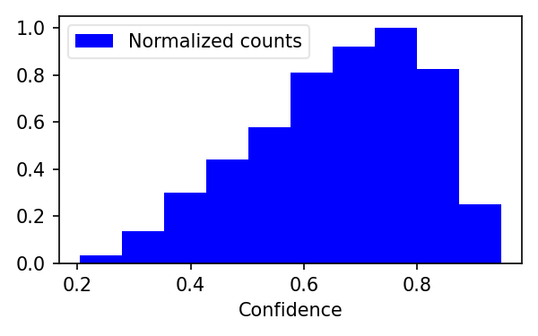 | 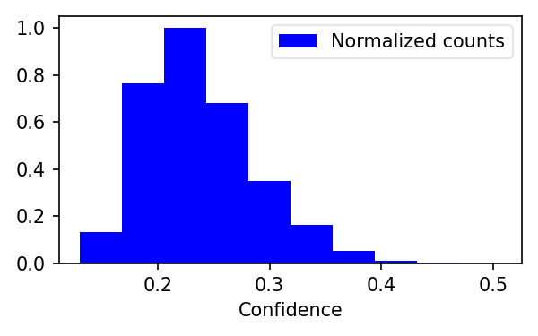 | 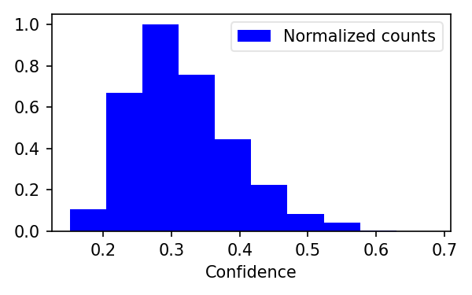 | 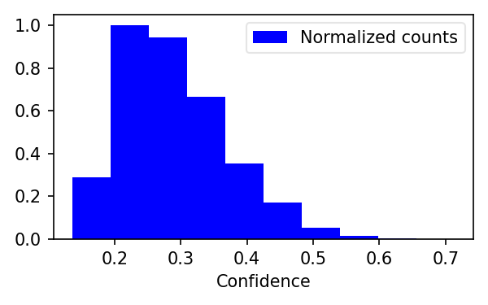


## Requirements

The main requirement is PyTorch>=1.5.0.

To be able to run this project and install the requirements simply execute (will work for GPUs or CPUs):

```
git clone https://github.com/martinferianc/BayesianNeuralNet-Tutorial
conda create --name venv --file requirements.txt --python=python3.6
conda activate venv
```

Then all the experiments are in the experiments folder in the main directory of this repository


## Contributing

This is a hobby project and if you would like to contribute more methods/tasks etc. Simply open up a pull-request and we can add your code in and you can become a contributor (I am really happy to share any credits, because maintaining this actively is going to be beyond my control).